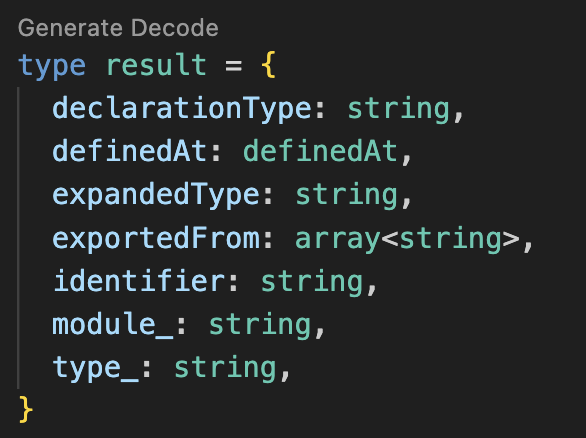

# Rescript Decode

Rescript Decode is a sophisticated Visual Studio Code extension meticulously crafted to streamline the process of transforming complex JSON objects into type-safe Rescript data structures. With Rescript Decode, you can effortlessly decode intricate data structures into precise Rescript types, ensuring robust and error-free code.

## Table of Contents

- [Usage](#usage)
- [Installation](#installation)
- [Features](#features)
- [Contributing](#contributing)

## Usage

For every Rescript type, a conveniently located interface button allows effortless generation of decode functions. A simple click on this button triggers the automatic creation of the function, which is then seamlessly copied to your clipboard for immediate and convenient integration into your codebase.

Get LogicUtils from this file [Utils](https://github.com/dilanbopanna/rescript-decode-vscode/blob/main/src/Utils/LogicUtils.res)

- Utilize the `enableDecodeButton` command to activate the decode button, which will be displayed above Rescript types.

## Installation

To make the most of this extension, follow these installation steps:

1. **Clone or Download**:
   - Clone or download the extension's source code from the [GitHub repository](https://github.com/dilanbopanna/rescript-decode-vscode).

2. **Main File and Commands**:
   - In the extension's primary file (`execution.js`), two vital commands are available: `enableDecodeButton` and `generateDecode`.
### Generating Decode Functions

- Upon clicking the decode button, it triggers the `generateDecode` command.
- This command invokes a Rescript function that dynamically generates decode functions for each Rescript type.
- The generated decode function is automatically copied to your clipboard for effortless integration into your codebase.

## Features

### 1. **Effortless Decoding**

Easily decode complex JSON objects into precise Rescript types with just a few clicks. Say goodbye to manual decoding and reduce the risk of runtime errors.

### 2. **Customizable Decoding Logic**

Tailor decoding logic to your project's specific requirements. Handle optional and nested fields with ease and create reusable decoders for your data structures.

### 3. **Seamless Integration**

Effortlessly integrate the Rescript Decode extension into your existing Rescript projects. Ensure compatibility and consistency across your codebase.

## Contributing

I welcome any kind of contributions to make this extension even better. If you'd like to contribute, here's how you can get involved:

1. **Fork the Repository**: Start by forking this repository to your GitHub account.

2. **Clone the Repository**: Clone the forked repository to your local development environment.

3. **Create a Branch**: Create a new branch for your contribution to keep your work isolated.

4. **Make Changes**: Implement your improvements or fixes, and ensure your code adheres to our coding standards.

5. **Test Thoroughly**: Test your changes to ensure they work as expected.

6. **Submit a Pull Request**: When ready, submit a pull request to the main repository, detailing your changes and why they're valuable.

7. **Collaborate**: Engage in discussions, address feedback, and work collaboratively to refine your contribution.

By contributing, you help enhance the Rescript Decode extension for the entire community. We appreciate your valuable input and look forward to your contributions!

